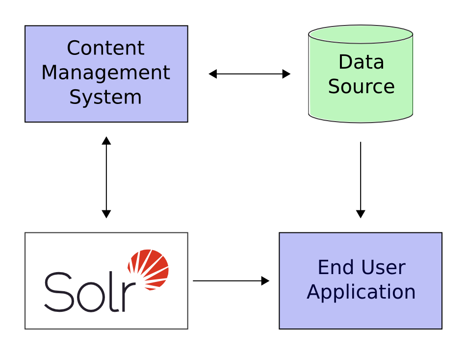

# 快速预览

尝过了Solr的趣味之后,你将学习它可以做的很酷的事情.

Solr在整个应用中是如何与其它部分协作的:

上图中, Solr 与其它服务应用隔离运行.比如,一个在线商城应用,应该有用户界面,购物车,和用户购买商品的途径,同时库存管理程序运行店员编辑商品信息.该商品的元数据将保存到数据库.

Solr的可以很容易地通过以下步骤添加在线商店搜索功能:

1. 定义schema.
2. 服务器上部署Solr.
3. 把用户可搜索商品数据输入给Solr.
4. 在应用中暴露一个搜索方法.

Solr基于开发标准,它具有高度可扩展性.Solr查询具有RESTful特性,本质上,它的请求是简单的http url请求,响应是结构化文档:主要为XML格式,不过它同时提供JSON,CSV,以及其它格式.也就是说各式各样的客户端都可以方便使用Solr,比如浏览器web应用，富连接应用，手机硬件等。任何支持HTTP的平台都可以和Solr协作。阅读[Client APIs](/api.md)了解更多客户端APIs.

Solr基于Apache Lucene项目，Lucene是一款高性能，多功能的搜索引擎。Solr提供多字段和分类下的简单关键字的包含跟多信息的复杂查询结果。
