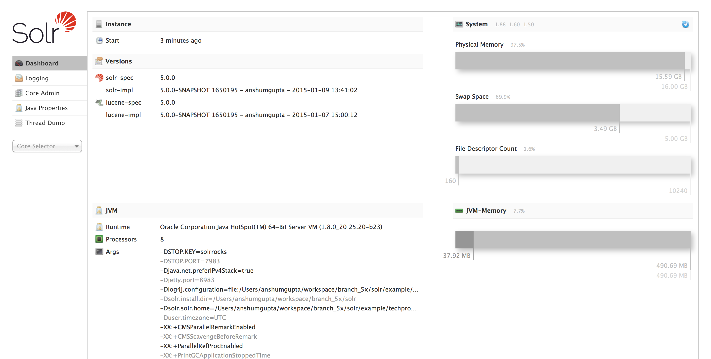

# 运行

本节介绍如何运行简单模式的Solr,添加文档,运行查询.

## 启动服务

如果你安装Solr之后没有启动,你可以运行Solr目录下的`bin/solr`可执行文件.

    $ bin/solr start

如果你使用Windows操作系统,你可以运行`bin\solr.cmd`来启动 Solr.

    bin\solr.cmd start

这将在后台运行Solr,并监听8983端口.

当后台启动Solr时,脚本在返回命令行前快速启动Solr.

脚本`bin/solr`和 `bin\solr.cmd`可以自定义Solr运行模式.我们来练习一些使用`bin/solr`脚本的例子(如果在Windows下运行,`bin\solr.cmd`和下面例子的使用方式一样):

### Solr脚本选项

`bin/solr` 脚本拥有多个选项.

### *脚本帮助*

查看使用`bin/solr`脚本说明,运行:

    $ bin/solr --help

### *前台运行Solr*

由于Solr是一个服务,通常运行于后台程序,特别是在Unix/Linux系统上.而在前台运行,只需运行:

    $ bin/solr start -f
如果是Windows,运行:

    $ bin\solr.cmd start -f

### *指定新端口运行*

使用-p参数,设置Solr的监听端口,例如:

    $ bin/solr start -p 8984

### *关闭Solr*

当在前台(使用 -f)运行Solr时,可以直接使用`Ctrl-c`关闭Solr.而在后台运行时,需要执行控制台命令来关闭:

    $ bin/solr stop -p 8983

关闭命令必须指定Solr的监听端口,或者使用`-all`参数关闭所有运行中的Solr.

### *指定示例配置运行Solr*

Solr提供多个实用的样例来帮助学习它的重要特性.使用`-e`标记来运行样例.如运行'Tech products'样例:

    $ bin/solr -e techproducts

目前供使用的样例有:techproducts, dih, schemaless和cloud.


&nbsp;&nbsp;&nbsp;**Getting Started SolrCloud**

&nbsp;&nbsp;&nbsp;&nbsp;&nbsp;&nbsp;&nbsp;运行cloud样例会以[SolrCloud](/solrcloud.md)模式启动.详细信息请查看[SolrCloud入门](/solrcloud/start.md).


### *查看Solr运行状态*

如果不确定solr是否正在运行,可以使用目录:

    $ bin/solr status

该命令会查找你本机运行的所有Solr实例,并展示它们的版本和内存使用等基本信息.

就这样,Solr运行起来了.如果要确认,可以在浏览器中打开管理界面.

http://localhost:8983/solr/

*The Solr Admin Interface*

如果Solr没有运行成功,页面会提示无法连接到服务器.确认端口是否正确,试着再来一次.

## 创建Core

如果不使用样例配置启动Solr,你需要创建一个core来索引和搜索.运行:

    $ bin/solr create -c <name>

这将创建一个当你建索引是能使用data-driver schema正确判断的field type的core.

查看新建core的所有可选项:

    $ bin/solr create -help

## 添加文档

Solr的目的是查找与查询条件匹配的文档. Solr的模式提供了对内容的结构化方式(更多请看[第四章](/document_field_schema.md)),如果没有文档,那还谈什么.要想Solr多产奶,就得先喂草.

你可能想在搜索想要的内容之前添加一点简单的文档. Solr提供了一些测试文档集,位于`example/`子目录下.

`bin/`目录是提交脚本,用来index不同类型文档的命令行工具.如果对详细过程感到困惑,[索引和基本数据操作](/index.md)提供了索引建立的全部细节.

查看`bin/post`脚本的使用说明,使用`-help`选项.

`bin/post`支持多种格式的内容.包括Solr的native XML文件,JSON格式,CVS文件,目录数文件,或者简单的web crawl.

接着,我们把所有JSON格式的文档添加到索引中:

```
$ bin/post -c gettingstarted example/exampledocs/*.json
SimplePostTool version 5.0.0
Posting files to [base] url http://localhost:8983/solr/gettingstarted/update...
Entering auto mode. File endings considered are
xml,json,csv,pdf,doc,docx,ppt,pptx,xls,xlsx,odt,odp,ods,ott,otp,ots,rtf,htm,html,txt,l
og
POSTing file books.json (application/json) to [base]
1 files indexed.
COMMITting Solr index changes to http://localhost:8983/solr/gettingstarted/update...
Time spent: 0:00:00.450
```
这样solr,就给所有这些文档建立了索引.